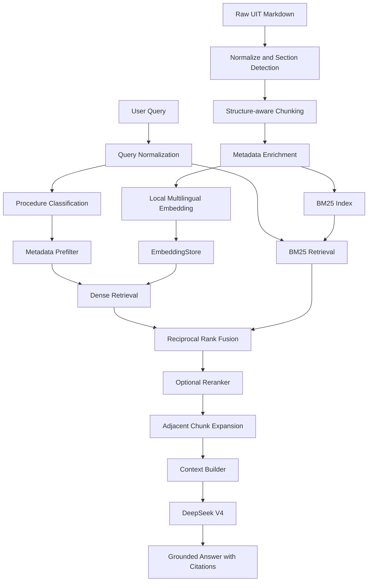
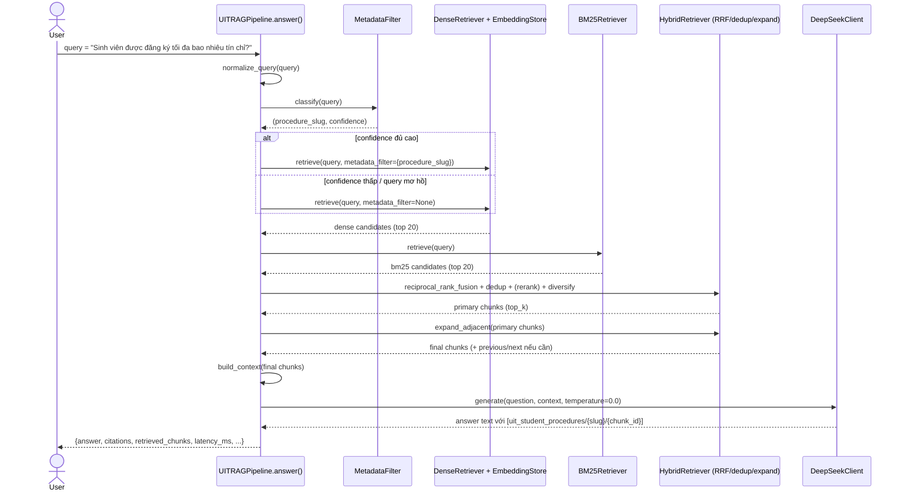

# Kiến trúc pipeline RAG cho tài liệu quy trình UIT

Tài liệu này mô tả kiến trúc của pipeline RAG "high-accuracy" được xây dựng thêm trong
`src/uit_preprocessing.py`, `src/structure_chunking.py`, `src/rag_embeddings.py`,
`src/retrieval.py`, `src/deepseek_client.py`, `src/rag_pipeline.py` và `bench.py`, dùng để
trả lời câu hỏi về `data/uit/quy-trinh-danh-cho-sinh-vien.md` với độ chính xác retrieval cao
nhất có thể, sinh câu trả lời có trích dẫn bằng DeepSeek.

> Các class/hàm bắt buộc của bài lab gốc (`FixedSizeChunker`, `SentenceChunker`,
> `RecursiveChunker`, `ChunkingStrategyComparator`, `EmbeddingStore`, `KnowledgeBaseAgent`,
> `Document`, `_mock_embed`, ...) trong `src/chunking.py`, `src/store.py`, `src/agent.py`,
> `src/models.py`, `src/embeddings.py` được giữ nguyên public API. Toàn bộ phần "nâng cao"
> mô tả ở đây nằm trong các **module mới**, không sửa các class/hàm đó.

## 1. Mục tiêu hệ thống

- Trả lời câu hỏi của sinh viên UIT **chỉ dựa trên** nội dung đã có trong
  `data/uit/quy-trinh-danh-cho-sinh-vien.md` — không tự suy diễn, không hoàn thiện quy định
  bằng kiến thức ngoài.
- Tối đa hoá **độ chính xác retrieval** (đúng quy trình, đúng đoạn chứa điều kiện/giới hạn/thời
  hạn) trước khi tối ưu văn phong câu trả lời.
- Câu trả lời phải có **trích dẫn** về đúng `chunk_id` đã dùng để sinh câu trả lời, và phải
  **từ chối** một cách rõ ràng khi tài liệu không chứa thông tin được hỏi.
- So sánh công khai, có số liệu, giữa một pipeline `baseline` đơn giản và một pipeline
  `high_accuracy` nhiều thành phần hơn — không tự tuyên bố `high_accuracy` tốt hơn nếu
  benchmark không chứng minh điều đó (xem `benchmark/results/latest.md`).

## 2. Vai trò từng thành phần

| Thành phần | Vai trò |
|---|---|
| **Source document** (`data/uit/quy-trinh-danh-cho-sinh-vien.md`) | Nguồn sự thật duy nhất. Không bao giờ bị ghi đè hay chỉnh sửa nội dung gốc bởi pipeline. |
| **Preprocessing** (`src/uit_preprocessing.py`) | Đọc file UTF-8, chuẩn hoá định dạng (newline, Unicode, khoảng trắng không ngắt, bullet, dòng trống) và cắt văn bản thành từng "procedure section" dựa trên anchor phrase khai báo trong `data/uit/procedure_boundaries.json`. Không đổi số liệu/URL/tên biểu mẫu/điều kiện/thứ tự bước/câu chữ gốc. |
| **Structure-aware chunking** (`src/structure_chunking.py`) | Chunk từng procedure section theo ranh giới đoạn văn/câu (không trộn 2 quy trình), gắn header ngắn cho embedding, sinh `chunk_id` deterministic và liên kết `previous_chunk_id`/`next_chunk_id`. |
| **Metadata enrichment** | Mỗi chunk mang `source_id`, `procedure_slug`, `procedure_title`, `section_index`, `chunk_index`, `content_hash` — dùng cho metadata filter, dedup và expansion. |
| **Local multilingual embedding** (`src/rag_embeddings.py`) | Nhúng văn bản (đã gắn header) bằng Sentence-Transformers đa ngôn ngữ (ưu tiên `BAAI/bge-m3`, fallback `paraphrase-multilingual-MiniLM-L12-v2`), có cache theo content-hash, không bao giờ dùng DeepSeek. |
| **EmbeddingStore** (`src/store.py`, tái sử dụng từ lab) | Lưu vector + metadata (ChromaDB nếu có, fallback in-memory), tìm kiếm bằng cosine similarity/dot product. |
| **BM25 Index** (`src/retrieval.py::BM25Retriever`) | Tìm kiếm từ vựng (lexical) trên `raw_text` đã chuẩn hoá, xử lý tiếng Việt cơ bản, không xoá số/mã biểu mẫu. |
| **Hybrid retrieval** (`src/retrieval.py::HybridRetriever`) | Điều phối: metadata pre-filter (nếu confidence cao) → dense retrieval → BM25 → Reciprocal Rank Fusion → dedup → (optional) reranker → diversify → adjacent expansion. |
| **Reranker** (`src/retrieval.py::Reranker`, optional) | Cross-encoder (`BAAI/bge-reranker-v2-m3`) rerank top-10 ứng viên sau RRF. Là optional dependency: nếu không cài được, pipeline log cảnh báo và tiếp tục với RRF, không crash. |
| **DeepSeek V4** (`src/deepseek_client.py`) | LLM generation duy nhất được phép dùng. Nhận context đã build từ các chunk trả về, sinh câu trả lời có trích dẫn, từ chối khi context không đủ. `temperature=0.0` cho benchmark. |
| **RAG pipeline orchestrator** (`src/rag_pipeline.py::UITRAGPipeline`) | Ghép toàn bộ các bước trên thành API công khai `build_index` / `retrieve` / `answer`, cộng CLI `build` / `retrieve` / `ask`. |
| **Benchmark** (`bench.py`, `benchmark/`) | Chạy 5 gold queries + 1 diagnostic query cho cả 2 strategy, đo retrieval metrics + answer metrics + latency, xuất `benchmark/results/latest.json` và `latest.md`. |

## 3. Sơ đồ luồng dữ liệu (ingest + query)



Chú ý: `Metadata Prefilter` chỉ thực sự lọc cứng (loại bỏ ứng viên) khi confidence phân loại
quy trình đủ cao (`MetadataFilter.should_filter`, ngưỡng mặc định 0.6); nếu không, `Dense
Retrieval`/`BM25 Retrieval` vẫn chạy trên toàn bộ index để tránh loại nhầm kết quả đúng.

## 4. Sequence diagram cho một câu hỏi (ví dụ: "ask")



## 5. Vì sao thiết kế như vậy

**Không dùng mock embedding cho benchmark.** `MockEmbedder` (trong `src/embeddings.py`) sinh
vector giả từ hash MD5 của văn bản — không mang ngữ nghĩa thật, chỉ dùng để unit test chạy
nhanh/ổn định không cần tải model. Benchmark đo "độ chính xác retrieval" thật nên phải dùng
embedding ngữ nghĩa thật (`LocalRAGEmbedder`), nếu không mọi số liệu Hit@1/Recall/MRR sẽ vô
nghĩa.

**DeepSeek không tạo embedding.** DeepSeek chỉ được cấu hình và gọi ở bước generation
(`src/deepseek_client.py`); toàn bộ embedding đi qua `src/rag_embeddings.py` (Sentence-
Transformers cục bộ). Điều này giữ document và query luôn dùng **cùng một** không gian vector,
và tránh phụ thuộc một LLM để làm luôn cả việc tìm kiếm.

**Dense và BM25 bổ trợ nhau.** Dense retrieval nắm được ngữ nghĩa/từ đồng nghĩa ("phúc khảo" ~
"xin xem lại điểm") nhưng có thể yếu với thực thể chính xác (mã biểu mẫu, số liệu như "24 tín
chỉ", "Mẫu 07"). BM25 mạnh với match từ-đối-từ chính xác nhưng bỏ sót diễn đạt đồng nghĩa. Kết
hợp bằng Reciprocal Rank Fusion tận dụng ưu điểm cả hai mà không cần chỉnh trọng số thủ công.

**Metadata chỉ filter khi confidence cao.** Nếu lọc cứng theo quy trình suy luận sai (câu hỏi
mơ hồ, dùng từ chung), sẽ loại mất chunk đúng ngay từ đầu — không retriever nào cứu được sau
đó. Vì vậy `MetadataFilter.should_filter()` chỉ filter khi đủ tin cậy; các câu hỏi mơ hồ vẫn
được tìm trên toàn bộ index.

**Reranker chỉ xử lý tập ứng viên nhỏ.** Cross-encoder rerank chính xác hơn dense/BM25 nhưng
chi phí tính toán cao hơn nhiều (so từng cặp query-chunk). Chỉ áp dụng cho top-10 sau RRF (không
phải toàn bộ index) để giữ latency hợp lý, và là dependency optional — pipeline không được phép
crash nếu reranker không cài được (`RerankerUnavailableError` được bắt và log warning).

**Cần giữ "condition words" và adjacent chunks.** Các từ định lượng như "tối đa", "chậm nhất",
"trong vòng", "dưới 30%" thường nằm sát ngay dấu hai chấm/label bước — nếu bị cắt chunk giữa
label và nội dung, câu trả lời sẽ mất đúng phần quan trọng nhất. `StructureAwareChunker` ưu
tiên không cắt giữa "Bước N" và nội dung, và `expand_adjacent()` lấy thêm chunk liền kề cùng
quy trình khi cần để không cắt đứt giữa điều kiện/bước.

## 6. Failure modes đã lường trước

- **Section title bị mất khi crawl**: một số quy trình trong file nguồn bắt đầu thẳng bằng
  "Bước 1" không có heading. Giải quyết bằng anchor phrase ổn định trong
  `data/uit/procedure_boundaries.json` thay vì chỉ dựa vào heading Markdown.
- **Chunk cắt mất điều kiện**: chunk quá nhỏ có thể tách rời điều kiện khỏi kết luận. Giảm
  thiểu bằng cách pack theo đoạn văn (không theo ký tự) và overlap ~80 token giữa các chunk
  liên tiếp.
- **Metadata filter quá chặt**: câu hỏi dùng từ khoá chung ("thủ tục", "quy trình") có thể bị
  phân loại nhầm quy trình. Giảm thiểu bằng ngưỡng confidence và không filter khi mơ hồ.
- **Dense retrieval bỏ sót mã biểu mẫu**: embedding ngữ nghĩa có thể xếp hạng thấp một chunk
  chỉ vì nó chứa nhiều số/mã ("Mẫu 07", "Mẫu 09") ít "giống câu hỏi" về mặt ngữ nghĩa. BM25 bù
  lại vì match chính xác các token này.
- **BM25 bỏ sót câu diễn đạt đồng nghĩa**: người dùng hỏi "xin nghỉ học" nhưng tài liệu dùng
  "tạm dừng học tập" — BM25 không match token nào. Dense retrieval bù lại nhờ ngữ nghĩa.
- **Context đúng nhưng DeepSeek diễn giải sai**: kể cả khi context chứa đúng thông tin, LLM vẫn
  có thể tóm tắt sai số liệu. System prompt yêu cầu rõ không đổi nghĩa từ định lượng và bắt
  buộc trích dẫn theo từng ý — giúp việc kiểm tra thủ công (hoặc `--llm-judge`) dễ phát hiện
  lỗi này hơn.
- **Nguồn không chứa câu trả lời**: câu hỏi hoàn toàn ngoài phạm vi tài liệu (ví dụ chi phí ký
  túc xá). Diagnostic query (`benchmark/diagnostic_queries.json`) kiểm tra đúng trường hợp này:
  hệ thống phải trả lời từ chối nguyên văn, không bịa.

## 7. Hướng dẫn chạy đầy đủ

```bash
# 1. Cài đặt
python -m pip install -r requirements.txt
python -m pip install -r requirements-rag.txt

# 2. Test lab gốc (42 passed, dùng mock embedder)
python -m pytest tests -v

# 3. Test module RAG nâng cao (mock/monkeypatch, không tải model / không gọi API thật)
python -m pytest tests_rag -v

# 4. Build index (embedding local thật, không cần DEEPSEEK_API_KEY)
python -m src.rag_pipeline build \
  --source data/uit/quy-trinh-danh-cho-sinh-vien.md \
  --strategy high_accuracy

# 5. Retrieve (không gọi DeepSeek)
python -m src.rag_pipeline retrieve \
  --query "Sinh viên được đăng ký tối đa bao nhiêu tín chỉ?"

# 6. Ask (cần DEEPSEEK_API_KEY trong .env hoặc biến môi trường)
python -m src.rag_pipeline ask \
  --query "Sinh viên được đăng ký tối đa bao nhiêu tín chỉ?"

# 7. Benchmark chỉ retrieval (không cần DEEPSEEK_API_KEY)
python bench.py --compare-strategies --skip-generation

# 8. Benchmark đầy đủ (retrieval + generation + answer metrics)
python bench.py --compare-strategies

# 9. So sánh riêng ảnh hưởng của embedding model (thí nghiệm khác, không trộn với so sánh strategy)
python bench.py --compare-strategies --embedding-model sentence-transformers/paraphrase-multilingual-MiniLM-L12-v2
python bench.py --strategy high_accuracy --embedding-model BAAI/bge-m3
```

Mỗi lần chạy `bench.py` ghi đè `benchmark/results/latest.json` và `benchmark/results/latest.md`
(hai file này **được commit** vào git — xem `.gitignore` — vì là báo cáo chấm điểm; các cache
model/vector index cục bộ thì không được commit).
